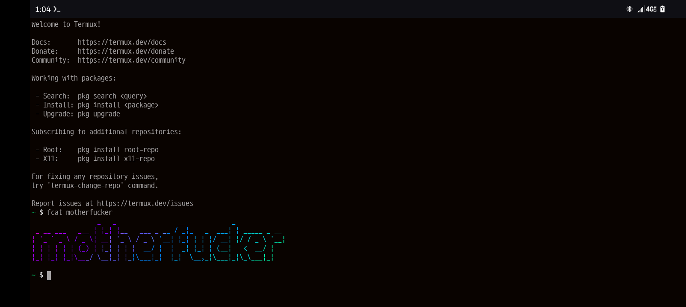

# fcat
script to automate piping from figlet to lolcat

# installation:  

so you want to put the script somewhere like this  

/data/data/com.termux/files/home/GitHub/fcat/fcat.py  

next make an alias called fcat:  

alias fcat="python /data/data/com.termux/files/home/GitHub/fcat/fcat.py"  

next call alias with quoted statement you want figlet to draw and lolcat to color  

like: fcat "Hello World"  

:)

 

